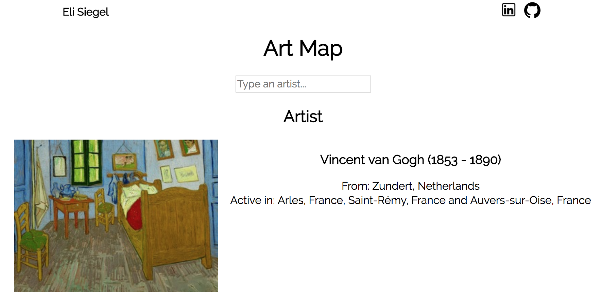
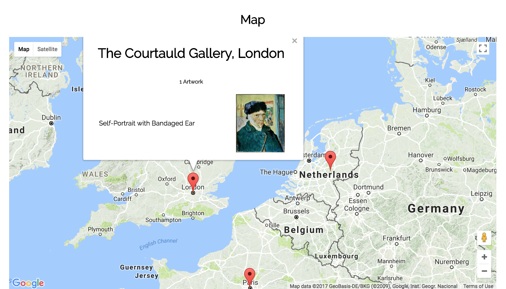

## Art Map

[Live](http://elicsiegel.com/Art/)



### Description

Art Map allows users to search an artist to see where his or her artworks are located around the world. The application is written in React/Redux. It uses the Artsy API to access information about the artist and his/her artworks and uses the Google Maps API to locate these works of art on a map.

### How to Use

Type an artists name in the search bar. Corresponding results will appear. Click on one to see where the artworks are!

User interaction was implemented via an input box that sends search queries to the Artsy API based on user input.

```javascript
updateResults(event){
    const searchQuery = event.target.value;
  
    if ( searchQuery.length < 2 ) {
      this.props.clearSearchResults();
      return;
    }

    this.props.sendSearchQuery(searchQuery);
}
```
### Features

#### Artwork List

Renders a list of artworks corresponding to the current selected artist. Clicking on an artwork will open up its info box in the Artwork Map below.



#### Artwork Map

After receiving coordinates from the Google Maps API, the Artwork Map component uses the MarkerManager class to place each artwork on the map at the museum in which it is housed. The marker clusterer library is used to cluster nearby markers together. 

```javascript
museum_coordinates.forEach(newCoord => this.createMarkerFromCoord(newCoord, artworks));

this.markerCluster = new MarkerClusterer(this.map, this.markers,
        {imagePath: 'https://developers.google.com/maps/documentation/javascript/examples/markerclusterer/m'});
```